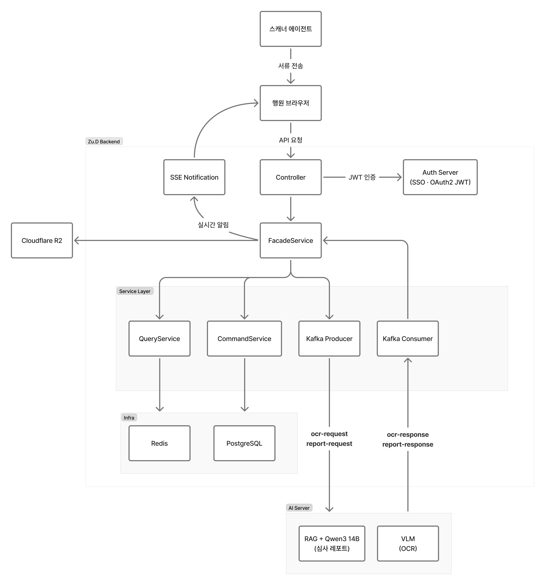

<div align="center">

# Zu.D Backend

![Java][badge-java-small]
![Spring Boot][badge-springboot-small]
![PostgreSQL][badge-postgresql-small]
![Redis][badge-redis-small]
![Kafka][badge-kafka-small]

[![Swagger][swagger-shield]][swagger-url]
[![Jenkins][jenkins-shield]][jenkins-url]

### 주택담보대출 서류 심사 자동화 DSS — Backend

> **은행원의 주담대 서류 심사 업무를 자동화하는 AI 기반 의사결정 지원 시스템**

</div>

---

## 📋 목차

- [📖 프로젝트 개요](#-프로젝트-개요)
- [✨ 백엔드 핵심 기능](#-백엔드-핵심-기능)
- [⚙️ 기술 스택](#️-기술-스택)
- [💡 기술 스택 선정 이유](#-기술-스택-선정-이유)
- [🏗️ 아키텍처](#️-아키텍처)
- [⭐ 설치 및 실행](#-설치-및-실행)
- [🔗 API 문서](#-api-문서)
- [👨🏻‍💻 코드 컨벤션](#-코드-컨벤션)
- [✍️ 커밋 컨벤션](#️-커밋-컨벤션)
- [💿 인프라 & 배포](#-인프라--배포)
- [❗ 자주 발생하는 문제](#-자주-발생하는-문제)
- [👥 Backend Team](#-backend-team)

---

## 📖 프로젝트 개요

> [!IMPORTANT]
> **Zu.D Backend**는 주택담보대출 서류 심사를 자동화하는 AI DSS(의사결정 지원 시스템)의 백엔드 서버입니다.

주담대 창구 상담은 건당 평균 1시간 이상 소요됩니다. 은행원은 수십 장의 서류를 수기로 검토하고, 수시로 바뀌는 내규를 일일이 확인하며, 결과를 전산에 직접 입력합니다. Zu.D는 이 과정 전체를 자동화합니다.

**서류 스캔 → OCR 추출 → 내규 기반 AI 심사 → 레포트 생성**까지, 행원은 최종 검토만 합니다.

**프로젝트 기간:** 2026.01.13 ~ 2026.02.21 (SSAFY 14기 특화 프로젝트)

**주요 책임:**
- 📄 **서류 OCR 파이프라인**: Kafka 기반 AI 서버 비동기 연동
- 📊 **AI 심사 레포트**: RAG + LLM 기반 내규 심사 자동화
- 🔐 **SSO 인증**: OAuth2 Resource Server + Redis 세션
- ☁️ **파일 저장**: Cloudflare R2 스캔 파일 관리
- 🔔 **실시간 알림**: SSE 기반 서버 푸시

---

## ✨ 백엔드 핵심 기능

### 1️⃣ 서류 관리 & OCR 파이프라인 (Document)

스캐너로 수신된 서류를 Cloudflare R2에 저장하고, Kafka를 통해 AI 서버로 OCR 요청을 비동기 전송합니다.

- 서류 업로드 및 S3-Compatible 스토리지 저장
- 서류 유형별 추출 데이터 구조화 (등기부등본, 재직증명서, 소득확인서 등)
- OCR 결과 수신 후 정합성 검증

**처리 흐름:**
```
서류 스캔 → R2 업로드 → Kafka OCR 요청
    → AI 서버 (VLM) → Kafka 결과 수신 → DB 저장 → SSE 알림
```

**핵심 기술:**
```java
// Kafka OCR 요청 발행
@Transactional
public void requestOcr(final UUID documentId) {
    DocumentOcrRequestMessage message = converter.toOcrRequestMessage(documentId);
    kafkaProducer.send(OCR_REQUEST_TOPIC, message);
    redisTemplate.opsForValue().set("ocr:status:" + documentId, OcrStatus.PENDING);
}
```

### 2️⃣ AI 심사 레포트 (Report)

추출된 서류 데이터와 내규(RAG) 검색 결과를 기반으로 AI가 심사 레포트를 생성합니다.

- Kafka 기반 심사 요청/응답 비동기 처리
- Redis 기반 레포트 처리 상태 관리 (`PENDING → PROCESSING → DONE`)
- 조항 단위 판단 근거 포함 — **XAI (설명 가능한 AI)**
- 금감원 AI 활용 가이드라인 준수 (보조수단의 원칙 — Human In the Loop)

**처리 흐름:**
```
심사 요청 → Kafka 발행 → AI 서버 (RAG + Qwen3 14B vLLM)
    → Kafka 응답 → 레포트 저장 → SSE 알림
```

**핵심 기술:**
```java
// Kafka 심사 결과 소비
@KafkaListener(topics = REPORT_RESPONSE_TOPIC)
public void consumeReportResult(final String payload) {
    ReportResultMessage message = objectMapper.readValue(payload, ReportResultMessage.class);
    reportFacadeService.saveReportResult(message);
    notificationService.notifyReportCompleted(message.consultationId());
}
```

### 3️⃣ Redis 2단 활용 전략

**① OCR / 레포트 처리 상태 관리**
```java
// 처리 상태 추적 (PENDING → PROCESSING → DONE)
redisTemplate.opsForValue().set("ocr:status:" + documentId, OcrStatus.PENDING, 1, TimeUnit.HOURS);
redisTemplate.opsForValue().set("report:status:" + reportId, ReportStatus.PROCESSING, 1, TimeUnit.HOURS);
```

**② JWT 토큰 블랙리스트 (SSO 연동)**
```java
// 로그아웃 시 토큰 무효화 (Auth 서버 연동)
authClient.revokeToken(accessToken);
```

### 4️⃣ 실시간 알림 (SSE)

- OCR 완료, 심사 완료 등 이벤트 SSE 푸시
- Kafka Consumer → SSE Emitter 연결

**핵심 기술:**
```java
// SSE 구독 및 이벤트 전송
@GetMapping(value = "/subscribe", produces = MediaType.TEXT_EVENT_STREAM_VALUE)
public SseEmitter subscribe(@AuthenticationPrincipal final UserPrincipal user) {
    return notificationService.subscribe(user.getId());
}
```

### 5️⃣ 부동산 시세 조회 (HousePrice)

- Kakao Maps API 연동 주소 검색
- SSAFY Open API 연동 부동산 시세 / 기대출 / 신용등급 조회
- 담보 감정 평가 데이터 관리

### 6️⃣ SSO 인증 & 보안 (Auth)

- 별도 Spring Authorization Server 기반 auth 서버와 연동
- OAuth2 Resource Server (JWT 서명 검증, JWKS URI)
- Redis Session 기반 토큰 블랙리스트
- 행원 전산 화면에서 SSO 원클릭 진입 (전환 비용 최소화)

---

## ⚙️ 기술 스택

## 📦 Backend Framework

![Java][badge-java]
![Spring Boot][badge-springboot]
![Spring Security][badge-spring-security]
![Spring Data JPA][badge-jpa]

## 💾 Database & Cache

![PostgreSQL][badge-postgresql]
![Redis][badge-redis]

## 📨 Messaging

![Apache Kafka][badge-kafka]

## ☁️ Infrastructure & Storage

![Docker][badge-docker]
![Cloudflare R2][badge-cloudflare]
![AWS S3 SDK][badge-s3]

## 🔐 Security & Auth

![OAuth 2.0][badge-oauth]
![JWT][badge-jwt]

## 🔗 External API

![Kakao Maps][badge-kakao]
![SSAFY Open API][badge-ssafy]

## 📊 Monitoring

![Prometheus][badge-prometheus]
![Actuator][badge-actuator]

## 🛠️ Development Tools

![Gradle][badge-gradle]
![Swagger][badge-swagger]
![Checkstyle][badge-checkstyle]

---

## 💡 기술 스택 선정 이유

### ☕ Java 25

- **Virtual Threads**: Kafka Consumer, SSE, R2 업로드 등 I/O 대기가 잦은 작업에서 스레드 풀 고갈 없이 요청을 처리할 수 있어 채택

### 🍃 Spring Boot 4.0.3

- **Spring Framework 7.x / Jakarta EE 11** 기반 최신 버전
- Spring Authorization Server와의 OAuth2 연동에 최신 Security 아키텍처 활용

### 🐘 PostgreSQL

- OCR 추출 결과 등 서류 유형별로 구조가 다른 데이터를 JSON 컬럼으로 저장 → 서류 유형마다 테이블을 분리하지 않아도 됨
- 트랜잭션 격리 수준 설정이 세밀해 금융 데이터의 정합성 관리에 유리

### 📨 Apache Kafka

- OCR / 레포트 생성은 AI 서버에서 수십 초가 소요됨 → 동기 호출 시 커넥션 점유 문제 발생
- Kafka를 통해 요청을 발행하고 결과를 별도 Consumer로 수신하는 구조로 분리
- `acks=all` + `enable.idempotence=true`로 메시지 유실 방지

```
Backend → Kafka → AI Server (VLM / RAG + LLM) → Kafka → Backend
```

### 🔴 Redis

- OCR / 레포트의 처리 상태(`PENDING → PROCESSING → DONE`)를 TTL과 함께 저장해 DB 폴링 없이 상태 조회
- Spring Session Redis로 Auth 서버와 분리된 구조에서도 세션 공유

### ☁️ Cloudflare R2

- AWS S3 SDK를 그대로 사용할 수 있어 별도 클라이언트 구현 없이 도입
- 서류 파일 조회 트래픽에 대한 egress 비용 없음

---

## 🏗️ 아키텍처

## CQRS 패턴 기반 계층형 아키텍처

```
Controller → FacadeService → Command/Query Service → Repository → Entity
```

> [!NOTE]
> Command(쓰기)와 Query(읽기)를 서비스 레이어에서 완전히 분리합니다. Facade가 두 레이어를 조율합니다.

**핵심 설계 원칙:**
- ✅ **CQRS 패턴**: Command / Query 완전 분리
- ✅ **Facade 패턴**: 복잡한 비즈니스 로직 조율
- ✅ **이벤트 기반**: Kafka 비동기 메시징으로 AI 서버와 느슨한 결합
- ✅ **Virtual Threads**: Java 25 가상 스레드로 I/O 집약적 처리 최적화
- ✅ **금융권 내부망 대응**: 외부 AI API 미사용, 로컬 모델 기반 설계

## 전체 시스템 흐름



## 도메인 구조 (11개)

```
domain/
├── audit/          # 감사 로그
├── auth/           # SSO 인증 연동
├── branch/         # 지점 관리
├── consultation/   # 상담 관리
├── customer/       # 고객 관리
├── document/       # 서류 관리 (OCR 요청/결과)
├── houseprice/     # 부동산 시세 / 감정평가
├── notification/   # 실시간 알림 (SSE)
├── report/         # AI 심사 레포트
└── user/           # 행원 사용자
```

**패키지 구조 (도메인별):**
```
domain/{domain}/
├── controller/          # REST API
├── service/
│   ├── {Domain}FacadeService.java
│   ├── command/
│   ├── query/
│   ├── kafka/           # Kafka Producer / Consumer
│   └── notification/    # SSE 이벤트
├── dto/
│   ├── request/
│   ├── response/
│   └── message/         # Kafka 메시지 DTO
├── entity/
├── repository/
├── converter/
├── enums/
└── exception/
```

---

## ⭐ 설치 및 실행

## 📋 필수 환경

> [!WARNING]
> Java 25 이상이 반드시 필요합니다. Virtual Threads 및 최신 언어 기능을 사용합니다.

| 항목         | 버전          |
|--------------|---------------|
| Java         | 25 (OpenJDK)  |
| PostgreSQL   | 15+           |
| Redis        | 7+            |
| Apache Kafka | 3.x           |

```bash
# 환경 확인
java --version       # openjdk 25+
psql --version       # PostgreSQL 15+
redis-server --version
```

---

## 🔧 환경 설정

> [!IMPORTANT]
> 아래 환경 변수를 `.env` 파일 또는 실행 환경에 설정하세요. 모든 시크릿은 코드에 직접 입력하지 않습니다.

```bash
# Database
DB_HOST=localhost
DB_PORT=5432
DB_NAME=zud
DB_USERNAME=zud
DB_PASSWORD=your-password

# Redis
REDIS_HOST=localhost
REDIS_PORT=6379
REDIS_PASSWORD=your-password

# Kafka
KAFKA_BOOTSTRAP_SERVERS=localhost:9092

# Cloudflare R2
CLOUDFLARE_ENDPOINT=https://your-account.r2.cloudflarestorage.com
CLOUDFLARE_BUCKET=your-bucket
CLOUDFLARE_ACCESS_KEY=your-access-key
CLOUDFLARE_SECRET_KEY=your-secret-key

# Auth Server (SSO)
AUTH_SERVER_URL=http://localhost:9000
AUTH_OAUTH_CLIENT_ID=zud-client
AUTH_OAUTH_CLIENT_SECRET=zud-secret
AUTH_JWKS_URI=http://localhost:9000/oauth2/jwks

# External API
KAKAO_REST_API_KEY=your-kakao-key
SSAFY_API_KEY=your-ssafy-key
```

---

## ▶️ 실행

**개발 모드:**
```bash
./gradlew bootRun
```

**프로덕션 빌드:**
```bash
./gradlew clean build -x test
java -jar build/libs/zud-0.0.1-SNAPSHOT.jar
```

**테스트:**
```bash
./gradlew test
./gradlew test --tests "*.DocumentServiceTest"
```

**코드 품질 검사:**
```bash
./gradlew checkstyleMain
```

> [!NOTE]
> 서버 시작: [http://localhost:8080][localhost]

---

## 🔗 API 문서

- 📖 **[Swagger UI][api-docs-url]**

## 💡 핵심 API

### 🔐 인증

```bash
POST /api/v1/auth/login              # 로그인 (SSO 연동)
POST /api/v1/auth/logout             # 로그아웃
POST /api/v1/auth/reissue            # 토큰 재발급
```

### 📄 서류 (OCR)

```bash
POST /api/v1/documents               # 서류 업로드 및 OCR 요청
GET  /api/v1/documents/{id}          # 서류 조회
GET  /api/v1/documents/{id}/ocr      # OCR 결과 조회
```

### 📊 심사 레포트

```bash
POST /api/v1/reports                 # 심사 요청
GET  /api/v1/reports/{id}            # 레포트 조회
```

### 🏠 부동산 시세

```bash
GET  /api/v1/houseprices             # 시세 조회
GET  /api/v1/houseprices/address     # 주소 검색 (Kakao Maps)
```

### 📋 상담

```bash
POST /api/v1/consultations           # 상담 생성
GET  /api/v1/consultations/{id}      # 상담 조회
```

### 🔔 알림

```bash
GET  /api/v1/notifications/subscribe # SSE 구독
GET  /api/v1/notifications           # 알림 목록
```

**전체 API:** [Swagger 문서][api-docs-url]

---

## 👨🏻‍💻 코드 컨벤션

> [!NOTE]
> 자세한 내용은 팀 Notion의 코드 컨벤션 문서를 참고하세요.

## 📌 코딩 스타일

- **네이버 캠퍼스 핵데이 Java 코딩 컨벤션** 적용
- 공식 문서: [네이버 코딩 컨벤션][naver-coding-convention]

## 🛠️ 개발 도구 설정

### IntelliJ IDEA

**1. CheckStyle Plugin**
- 플러그인 설치: `Preferences > Plugins > CheckStyle-IDEA`
- 규칙 파일: `config/checkstyle/zud-checkstyle-rules.xml`
- Suppression: `config/checkstyle/zud-checkstyle-suppressions.xml`

**2. 검증 실행**
```bash
./gradlew checkstyleMain
```

## 📏 주요 규칙

- **들여쓰기**: 공백 4칸
- **줄 길이**: 최대 120자
- **import**: wildcard 금지, 정렬 순서 준수
- **네이밍**: camelCase (메서드/변수), PascalCase (클래스)
- **매개변수**: 모든 메서드 매개변수에 `final` 키워드 필수

---

## ✍️ 커밋 컨벤션

> [!NOTE]
> 자세한 내용은 팀 Notion의 커밋 컨벤션 문서를 참고하세요.

Gitmoji 기반 커밋 메시지를 사용합니다.

| 이모지 | 태그          | 의미            |
|--------|---------------|-----------------|
| ✨     | `feat`        | 새 기능         |
| 🐛     | `fix`         | 버그 수정       |
| ♻️     | `refactor`    | 리팩토링        |
| 🔀     | `merge`       | 브랜치 머지     |
| 📝     | `docs`        | 문서 수정       |
| 🔧     | `config`      | 설정 변경       |
| 🗃️     | `db`          | DB/마이그레이션 |
| ✅     | `test`        | 테스트          |
| 🚑️    | `hotfix`      | 긴급 수정       |

```bash
# 예시
✨ feat: 심사 레포트 Kafka 소비자 구현
🐛 fix: OCR 결과 정합성 검증 누락 수정
♻️ refactor: DocumentFacadeService 의존성 정리
```

---

## 💿 인프라 & 배포

> [!NOTE]
> 자세한 내용은 팀 Notion의 인프라 & 배포 문서를 참고하세요.

## 🐳 Docker 구성

**Dockerfile:**
```dockerfile
FROM eclipse-temurin:25-jre-alpine
WORKDIR /app
COPY build/libs/*.jar app.jar
EXPOSE 8080
ENTRYPOINT ["java", "-jar", "app.jar"]
```

## 🚀 배포 방법

```bash
# 1. 빌드
./gradlew clean build -x test

# 2. Docker 이미지 생성
docker build -t zud-backend:latest .

# 3. 전체 스택 실행 (infra/ 디렉토리)
docker-compose up -d

# 4. 로그 확인
docker-compose logs -f zud-backend
```

## 📊 모니터링

**Health Check:**
```bash
curl http://localhost:8080/actuator/health
```

**Prometheus 메트릭:**
```bash
curl http://localhost:8080/actuator/prometheus
```

---

## ❗ 자주 발생하는 문제

### 🗄️ Database Connection Failed

**증상:** `Unable to acquire JDBC Connection`

**해결:**
```bash
# PostgreSQL 실행 확인
psql -U zud -d zud -h localhost
```

> [!WARNING]
> `spring.jpa.hibernate.ddl-auto: validate` 설정이 되어 있어, 스키마가 맞지 않으면 서버가 시작되지 않습니다. 마이그레이션 스크립트 적용 여부를 확인하세요.

### 🔴 Redis Connection Refused

**해결:**
```bash
redis-server
redis-cli ping    # PONG 확인
```

### 📨 Kafka 연결 실패

**증상:** `org.apache.kafka.common.errors.TimeoutException`

**해결:**
```bash
# Kafka 브로커 실행 확인
kafka-topics.sh --list --bootstrap-server localhost:9092
```

### ☁️ Cloudflare R2 Upload Failed

**해결:** Access Key 권한 확인 (`R2:PutObject`, `R2:GetObject`, `R2:DeleteObject`)

### 🔐 JWT 검증 실패

**증상:** `401 Unauthorized`

**해결:** Auth 서버 JWKS URI 접근 가능 여부 확인
```bash
curl ${AUTH_JWKS_URI}   # {"keys":[...]} 응답 확인
```

---

## 📚 추가 문서

## 📝 Notion 문서 (상세 버전)

- **[👨🏻‍💻 코드 컨벤션][backend-code-convention]** — IntelliJ 설정, CheckStyle 플러그인 설치 가이드
- **[✍️ 커밋 컨벤션][backend-commit-convention]** — Gitmoji 플러그인 설정, 커밋 메시지 예시

---

### **Zu.D — 주택담보대출 서류 심사 자동화 DSS**

**📖 [API 문서][api-docs-url]**

*Made with love by SSAFY 14th A406 Backend Team*

---

<!-- Badges (Small) -->
[badge-java-small]: https://img.shields.io/badge/Java_25-007396?style=flat&logo=openjdk&logoColor=white
[badge-springboot-small]: https://img.shields.io/badge/Spring_Boot_4.0.3-6DB33F?style=flat&logo=springboot&logoColor=white
[badge-postgresql-small]: https://img.shields.io/badge/PostgreSQL-4169E1?style=flat&logo=postgresql&logoColor=white
[badge-redis-small]: https://img.shields.io/badge/Redis-DC382D?style=flat&logo=redis&logoColor=white
[badge-kafka-small]: https://img.shields.io/badge/Kafka-231F20?style=flat&logo=apachekafka&logoColor=white

<!-- Badges (Large) -->
[badge-java]: https://img.shields.io/badge/Java%2025-ED8B00?style=for-the-badge&logo=openjdk&logoColor=white
[badge-springboot]: https://img.shields.io/badge/Spring%20Boot%204.0.3-6DB33F?style=for-the-badge&logo=springboot&logoColor=white
[badge-spring-security]: https://img.shields.io/badge/Spring%20Security-6DB33F?style=for-the-badge&logo=springsecurity&logoColor=white
[badge-jpa]: https://img.shields.io/badge/Spring%20Data%20JPA-6DB33F?style=for-the-badge&logo=spring&logoColor=white
[badge-postgresql]: https://img.shields.io/badge/PostgreSQL-4169E1?style=for-the-badge&logo=postgresql&logoColor=white
[badge-redis]: https://img.shields.io/badge/Redis-DC382D?style=for-the-badge&logo=redis&logoColor=white
[badge-kafka]: https://img.shields.io/badge/Apache%20Kafka-231F20?style=for-the-badge&logo=apachekafka&logoColor=white
[badge-docker]: https://img.shields.io/badge/Docker-2496ED?style=for-the-badge&logo=docker&logoColor=white
[badge-cloudflare]: https://img.shields.io/badge/Cloudflare%20R2-F38020?style=for-the-badge&logo=cloudflare&logoColor=white
[badge-s3]: https://img.shields.io/badge/AWS%20S3%20SDK-FF9900?style=for-the-badge&logo=amazons3&logoColor=white
[badge-oauth]: https://img.shields.io/badge/OAuth%202.0-3423A6?style=for-the-badge&logo=auth0&logoColor=white
[badge-jwt]: https://img.shields.io/badge/JWT-000000?style=for-the-badge&logo=jsonwebtokens&logoColor=white
[badge-kakao]: https://img.shields.io/badge/Kakao%20Maps-FFCD00?style=for-the-badge&logo=kakao&logoColor=black
[badge-ssafy]: https://img.shields.io/badge/SSAFY%20Open%20API-009AFF?style=for-the-badge&logo=data:image/svg+xml;base64,&logoColor=white
[badge-prometheus]: https://img.shields.io/badge/Prometheus-E6522C?style=for-the-badge&logo=prometheus&logoColor=white
[badge-actuator]: https://img.shields.io/badge/Spring%20Actuator-6DB33F?style=for-the-badge&logo=spring&logoColor=white
[badge-gradle]: https://img.shields.io/badge/Gradle-02303A?style=for-the-badge&logo=gradle&logoColor=white
[badge-swagger]: https://img.shields.io/badge/Swagger-85EA2D?style=for-the-badge&logo=swagger&logoColor=black
[badge-checkstyle]: https://img.shields.io/badge/Checkstyle-4A90D9?style=for-the-badge&logo=checkmarx&logoColor=white

<!-- Internal Links -->
[localhost]: http://localhost:8080
[api-docs-url]: http://localhost:8080/swagger-ui/index.html

<!-- Service Links -->
[swagger-shield]: https://img.shields.io/badge/Swagger-85EA2D?style=for-the-badge&logo=swagger&logoColor=black
[swagger-url]: https://j14a406.p.ssafy.io/swagger-ui/index.html#/
[jenkins-shield]: https://img.shields.io/badge/Jenkins-D24939?style=for-the-badge&logo=jenkins&logoColor=white
[jenkins-url]: http://j14a406.p.ssafy.io:8080/

<!-- Convention Docs -->
[naver-coding-convention]: https://naver.github.io/hackday-conventions-java/

<!-- Notion 문서 URL은 팀 링크로 교체하세요 -->
[backend-code-convention]: https://supsuphae.notion.site/3046d0e2bc9880588e8aeef89820274d?source=copy_link
[backend-commit-convention]: https://supsuphae.notion.site/3046d0e2bc988029b83dfab0f380bb85?source=copy_link
